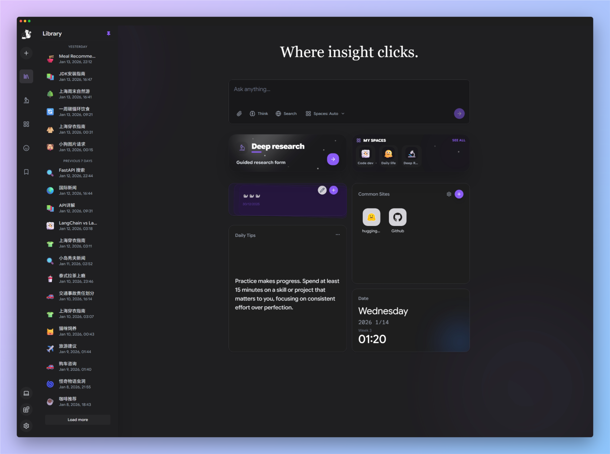
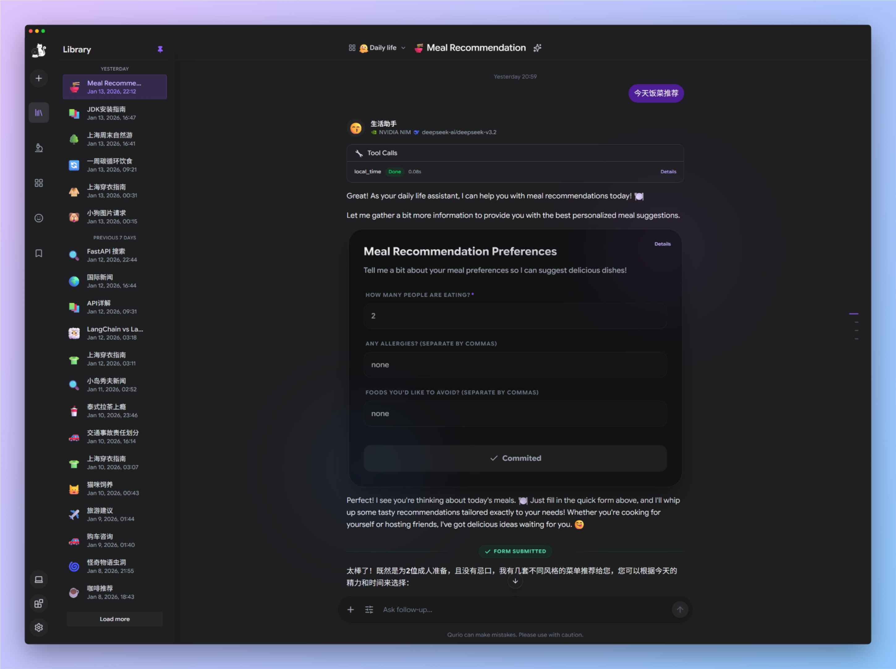
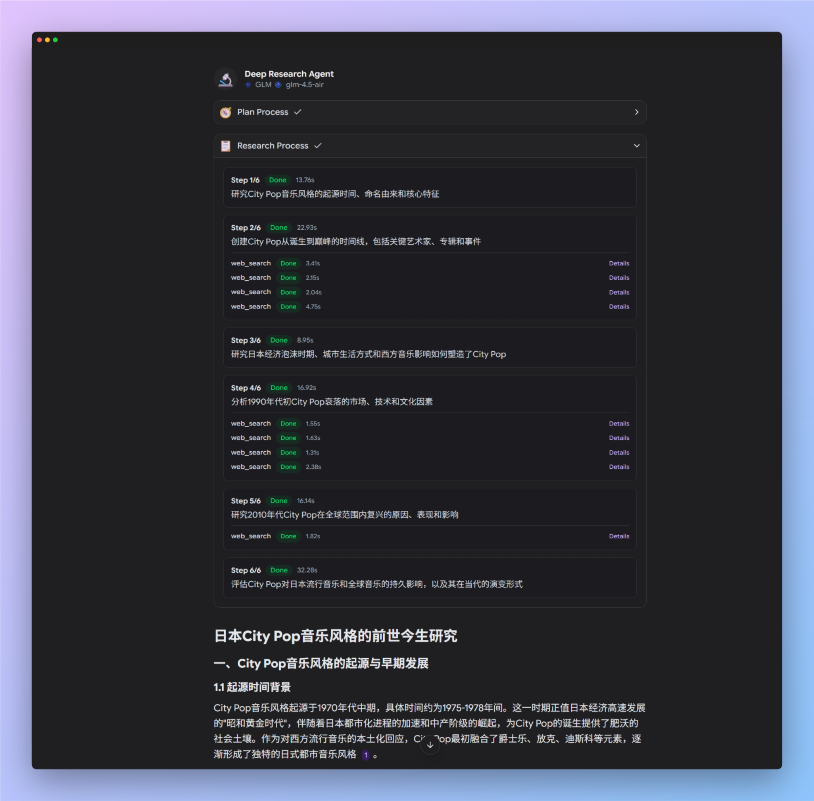
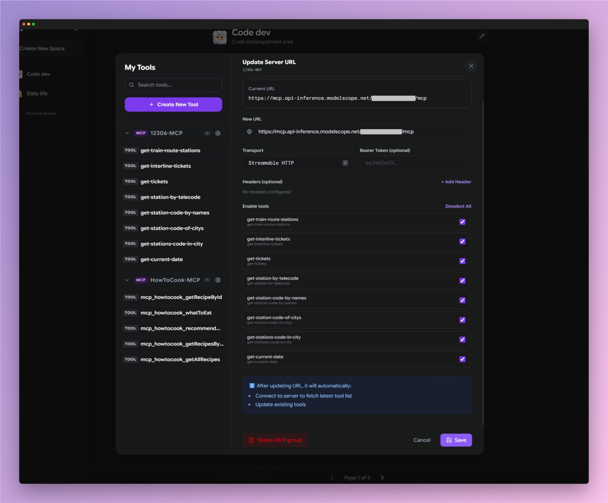

# Qurio - Multi-Provider AI Knowledge Workspace


> Not another chat UI. Qurio is a research-grade cockpit for real work.

**Qurio** is a high-velocity AI knowledge workspace built for teams that demand more than basic chat. It supports generic OpenAI-compatible providers, Gemini, SiliconFlow, Kimi (Moonshot), MiniMax, GLM (Zhipu), NVIDIA NIM, and more. Highlights include **Deep Research** for complex tasks, **Custom Agents** for specialized workflows, rich tool orchestration (MCP + HTTP), and structured reasoning views with export-ready outputs.

**In one line:** plan, tool, and deliver from a single workspace without switching apps.

## Screenshots

<!--
Add screenshots by replacing the placeholders below.
Recommended size: 1600x900 or 1920x1080.
-->

### Home



### Conversation + Tool Calls



### Deep Research Workflow



### MCP Tool Groups



## Why Qurio

- **Multi-Provider Powerhouse**: Connect to almost any model (Gemini, OpenAI, Claude via compatible endpoints, SiliconFlow, Kimi, MiniMax, GLM, NIM, etc.) with dual model slots (Lite + Default).
- **Tool Orchestration Beyond LLM Chat**: Built-in MCP + HTTP tooling, tool grouping, and per-tool enable/disable controls so agents only see what you want them to use.
- **Deep Research, Not Just Search**: Dedicated research workflow that plans, executes, and reports with structured steps, citations, and export-ready outputs.
- **Agent System That Scales**: Per-agent prompts, model preferences, and toolsets with clean switching and workspace binding.
- **Premium UX**: Streaming, rich Markdown/Code rendering, inline images, reasoning visibility, and thoughtful UI for research/think/tool panels.
- **Production-Grade**: Light/Dark/System themes, secure API key handling, i18n (en/zh), responsive design, Supabase persistence.

## Highlights

### 📱 Mobile PWA Support

- **Installable**: Add Qurio to your home screen on iOS/Android for an app-like experience.
- **Responsive UX**: Optimized layouts for mobile, tablets, and desktops with touch-friendly controls.
- **Seamless Sessions**: Stay signed in and continue where you left off with persistent conversations.

### 🔬 Academic Research Reports

- **Automated Research Pipeline**: Deep Research mode breaks down complex research goals into structured plans, conducts iterative web searches, and synthesizes comprehensive academic-style reports with proper citations.
- **Source Tracking**: All claims are backed by timestamped sources with direct links, ensuring research integrity and easy verification.
- **Export-Ready**: Generate polished reports in Markdown format, ready for academic or professional use.

### 🤖 Intelligent Agent System

- **Custom Agents**: Create specialized AI personas with unique system prompts, model preferences, and personality traits (tone, warmth, enthusiasm).
- **Automatic Agent Selection**: The system can intelligently select the best agent for your task based on context, or you can manually choose from your agent library.
- **Multi-Model Support**: Each agent can have dual model slots (Default + Lite) from different providers, optimizing for quality vs. speed.
- **Space-Agent Binding**: Assign specific agents to workspaces for consistent behavior across related conversations.

### 🧰 MCP + HTTP Tooling

- **MCP Tool Groups**: Connect external MCP servers (SSE or Streamable HTTP) and manage tools as groups.
- **Per-Tool Enable/Disable**: Keep tools saved while selectively hiding them from agents.
- **HTTP API Tools**: Define custom tools by URL, method, and JSON params; schemas are auto-generated from templates.
- **Interactive Forms**: Tools can request structured user input inline before execution.

### 🧾 Interactive Forms

- **Dynamic Form Generation**: AI agents can request structured input through beautifully rendered forms with various field types (text, number, select, textarea, etc.).
- **Real-time Validation**: Form inputs are validated before submission, ensuring data quality.
- **Seamless UX**: Forms appear inline in the conversation flow, maintaining context while collecting detailed information.

### 🌐 Extended Provider Support

Out-of-the-box support for:

- **Google Gemini** (Native SDK with Thinking mode)
- **SiliconFlow** (DeepSeek-R1, Qwen, etc.)
- **Kimi (Moonshot)**
- **MiniMax**
- **GLM (Zhipu AI)**
- **ModelScope**
- **NVIDIA NIM**
- **OpenAI & Compatibles** (Any standard endpoint)

### 🧩 Production-Grade Features

- **Question Timeline**: Interactive history cards grouped by time (Today, Yesterday, Past 7 Days) with instant search.
- **Security & Privacy**: API keys stored securely in Supabase or kept in-memory (never in LocalStorage for sensitive keys).
- **Personalization**: Adjust font sizes, interface language (en/zh), AI response styles, and theme (Light/Dark/System).
- **Media Support**: Drag & drop images, paste screenshots, and render inline media with vision-capable models.

## Tech Stack

- **Frontend**: React 19, TanStack Router v1, Zustand (State), Tailwind CSS v4, Lucide Icons.
- **Build**: RSBuild + Bun for lightning-fast dev and build.
- **Data**: Supabase (PostgreSQL) for Spaces, Conversations, Messages, and Settings.
- **AI Integration**: Custom adapter layer unifying various provider SDKs and REST APIs; LangChain integration for agentic workflows.
- **Rendering**: `react-markdown`, `remark-gfm`, `react-syntax-highlighter` for rich content.

## Getting Started

1. **Prerequisites**
   - [Bun](https://bun.sh/) 1.3+
   - A [Supabase](https://supabase.com/) project (for persistence)
   - [Tavily](https://tavily.com/) API Key (essential for Web Search & Deep Research)

2. **Install**

   ```bash
   git clone <your-repo-url>
   cd qurio
   bun install
   cd backend
   bun install
   ```

3. **Environment**
   Copy `.env.example` to `.env` and configure your keys. Key variables include:
   - `PUBLIC_SUPABASE_URL`, `PUBLIC_SUPABASE_KEY`
   - `PUBLIC_TAVILY_API_KEY` (Required for Search/Deep Research)

   **Provider Keys (Optional depending on usage):**
   - `PUBLIC_GOOGLE_API_KEY`
   - `PUBLIC_OPENAI_API_KEY` & `PUBLIC_OPENAI_BASE_URL`
   - `PUBLIC_SILICONFLOW_API_KEY`
   - `PUBLIC_KIMI_API_KEY`
   - `PUBLIC_MINIMAX_API_KEY`
   - `PUBLIC_GLM_API_KEY`
   - `PUBLIC_MODELSCOPE_API_KEY`
   - `PUBLIC_NVIDIA_API_KEY`

4. **Database Setup**
   In your Supabase dashboard, open the SQL Editor and run the contents of `supabase/schema.sql`. This creates the necessary tables (spaces, conversations, messages, settings, etc.) and Row Level Security (RLS) policies.

5. **Run (Frontend + Backend)**

   ```bash
   # One command (frontend + backend)
   bun run dev:full
   ```

   Frontend: `http://localhost:5173`  
   Backend: `http://localhost:3001`

   ```bash
   # Frontend only
   bun run dev

   # Backend only
   bun run dev:backend
   ```

6. **Build**
   ```bash
   bun run build
   ```

## Usage Tips

- **Settings**: Click the gear icon to set up providers. You can verify your Supabase connection and input API keys directly in the UI if you didn't set them in `.env`.
- **Deep Research**: Navigate to the "Deep Research" tab (Microscope icon) to start a comprehensive research task. This mode automatically browses the web and aggregates information.
- **Agents**: Use the "Agents" menu to create specialized personas. Assign a "Coding God" agent to use a high-reasoning model like `DeepSeek-R1` or `o1`, and a "Casual Chat" agent to use `Gemini Flash`.
- **Search**: The "Web Search" toggle uses Tavily to fetch real-time info. It's automatically invoked by Deep Research but can be toggled manually in normal chat.
- **Shortcuts**:
  - `Enter` to send, `Shift+Enter` for newline.
  - `Cmd/Ctrl + K` (if implemented) or UI buttons to switch agents/models quickly.
- **Styling**: Go to Settings -> Appearance to toggle Dark Mode or adjust Font Size.

## Project Structure

- `/src/lib/providers.js`: Core logic for adapting different AI APIs.
- `/src/components/chat`: Chat interface components (Input, Bubble, Header).
- `/src/views`: Top-level route views (Home, Conversation, DeepResearch, Spaces).
- `/supabase`: SQL migrations and schema definitions.

## Contributing

Pull requests are welcome for improvements (UI polish, new providers, bug fixes). Please open an issue for major feature requests.

## License

**Non-commercial**: Provided for personal and educational use. See [LICENSE](./LICENSE).
