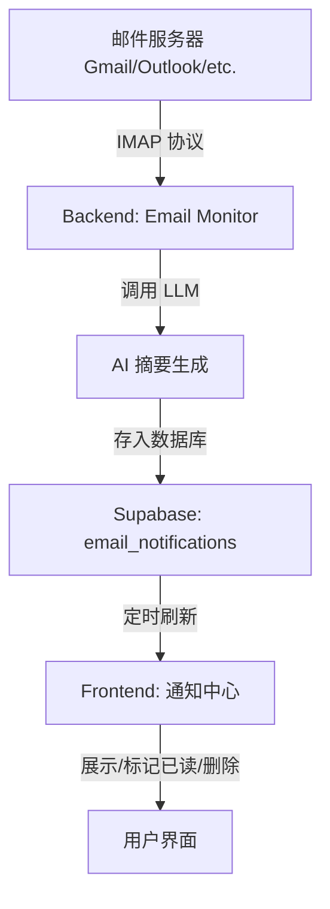

# Email Notification & AI Summary (邮件通知与 AI 摘要)

本文件总结了 Qurio 中邮件通知功能的设计、实现及使用方法。

## 1. 功能概述
邮件通知功能允许用户连接自己的邮箱（如 Gmail, Outlook, QQ, 163 等），系统会自动定时拉取新邮件，并利用大语言模型（LLM）生成简洁的摘要，最后以应用内通知的形式推送给用户。

## 2. 技术架构

### 2.1 整体流程

### 2.2 核心组件
- **Backend (Python)**:
  - `email_monitor.py`: 定时调度器（APScheduler），管理所有已连接账号的轮询。
  - `email_providers/`: 封装不同邮件厂商的接入逻辑，目前统一采用 IMAP + App Password 方案。
  - `routes/email.py`: 提供配置管理、通知列表、已读/删除操作等 API。
- **Frontend (React)**:
  - `GmailSettingsPanel.jsx`: 邮件连接与模型配置面板。
  - `NotificationCenter.jsx`: 顶部铃铛图标及通知列表模态框。

## 3. 关键特性

### 3.1 稳定的 IMAP 认证
由于 OAuth2 在代理环境下容易失效，系统采用了 **IMAP + 应用专用密码** 方案，确保了在国内及各种网络环境下的连接稳定性。

### 3.2 智能模型同步 (Global Model Sync)
- **无感配置**：邮件摘要功能深度联动系统“全局设置”。如果用户未在邮件面板指定模型，系统会自动回退使用全局设置的摘要模型。
- **动态过滤**：在配置界面，系统会自动过滤掉未配置 API Key 的 AI 厂商，防止无效配置。

### 3.3 高效的轮询与去重
- **状态感知**：仅抓取“未读”邮件。
- **ID 去重**：基于邮件唯一 `Message-ID`，确保同一封邮件绝不会重复总结。
- **排序優化**：通知列表嚴格按照郵件 **接收時間 (received_at)** 倒序排列，確保最直觀的查閱順序。

### 3.4 交互体验
- **立即同步**：支持在设置面板一键手动触发邮件拉取。
- **乐观更新**：标记已读或删除通知时，界面立即响应，无需等待后端确认。

## 4. 配置指南

### 4.1 获取应用专用密码
1. **Gmail**: 开启两步验证 -> Google 账号安全设置 -> 应用专用密码 -> 生成 16 位代码。
2. **QQ/163**: 進入郵箱設置 -> 賬戶 -> 開啟 IMAP/SMTP 服務 -> 獲取授權碼。

### 4.2 应用内设置
1. 进入 **设置 -> 邮件通知**。
2. 输入邮箱及应用密码，选择对应的廠商。
3. 配置摘要模型（建议使用全局默认设置）。
4. 保存并在铃铛图标处查看推送。

## 5. 开发建议 (Future Work)
- **附件解析**：支持对邮件附件（PDF/Docx）进行初步摘要。
- **邮件提醒过滤**：通过关键词或黑名单，过滤掉不需要总结的广告邮件。
- **OAuth2 回归**：在网络条件允许的情况下，可以考虑重新支持 OAuth2 以提升安全性。

---
*Created by Antigravity on 2026-02-18.*
