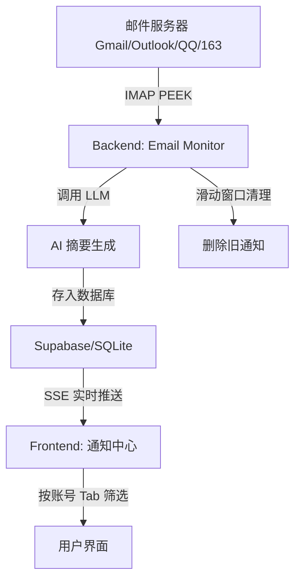

# Email Notification & AI Summary (邮件通知与 AI 摘要)

本文件总结了 Qurio 中邮件通知功能的设计、实现及使用方法。

## 1. 功能概述

邮件通知功能允许用户连接多个邮箱（如 Gmail, Outlook, QQ, 163 等），系统会自动定时拉取新邮件，并利用大语言模型（LLM）生成简洁的摘要，最后以应用内通知的形式推送给用户。

**核心特性**：
- 多邮箱账号支持，可同时连接多个邮箱
- 滑动窗口机制，每个账号仅保留最新 5 条通知
- IMAP PEEK 技术，拉取邮件不改变已读状态
- SSE 实时推送，无需轮询即可获取新通知
- 支持 Supabase 和 SQLite 双数据库

## 2. 技术架构

### 2.1 整体流程


### 2.2 核心组件
- **Backend (Python)**:
  - `email_monitor.py`: 定时调度器（APScheduler），管理所有已连接账号的轮询、SSE 广播、滑动窗口清理。
  - `email_providers/gmail.py`: IMAP 邮件拉取，使用 `BODY.PEEK[]` 避免标记已读。
  - `routes/email.py`: 提供多账号配置管理、通知列表、SSE 流、已读/删除操作等 API。
- **Frontend (React)**:
  - `GmailSettingsPanel.jsx`: 多邮箱连接与模型配置面板。
  - `NotificationCenter.jsx`: 顶部铃铛图标、按账号 Tab 筛选、通知详情弹窗。

## 3. 关键特性

### 3.1 多邮箱账号支持
- **Tab 筛选**：通知中心顶部显示所有已连接的邮箱账号，点击 Tab 可按账号筛选通知。
- **未读徽章**：每个 Tab 显示该账号的未读数量。
- **横向滚动**：账号过多时支持横向滚动。

### 3.2 滑动窗口机制
- **限制数量**：每个邮箱账号最多保留 5 条最新通知。
- **自动清理**：每次轮询后自动删除超出限制的旧通知，防止数据库膨胀。
- **实现位置**：`email_monitor.py` 中的 `_cleanup_old_notifications()` 函数。

### 3.3 IMAP PEEK（不标记已读）
- **问题**：普通 IMAP 拉取会将邮件标记为已读，影响用户在邮箱客户端的体验。
- **解决**：使用 `BODY.PEEK[]` 命令拉取邮件内容，不改变邮件的已读状态。
- **实现位置**：`email_providers/gmail.py` 中的 `fetch_new_emails()` 方法。

### 3.4 SSE 实时推送
- **替代轮询**：前端通过 EventSource 连接 `/api/email/notifications/stream` 端点。
- **事件类型**：
  - `connected`: 连接建立
  - `notifications_updated`: 有新通知，携带 `unread_count`
- **心跳保活**：每 30 秒发送 keepalive 注释，防止连接超时。

### 3.5 交互体验
- **点击查看详情**：点击通知条目打开详情弹窗，显示完整摘要。
- **跳转邮箱**：点击外部链接图标跳转到对应邮箱查看原文。
- **乐观更新**：标记已读或删除通知时，界面立即响应。
- **弹窗尺寸**：通知列表和详情弹窗均采用更大的尺寸（max-w-xl / max-w-2xl）。

### 3.6 双数据库支持
- **Supabase**：通过迁移文件 `20260218210000_add_email_notifications.sql` 创建表。
- **SQLite**：通过 `sqlite_schema.py` 自动创建表，应用启动时自动执行。

## 4. 数据库 Schema

### 4.1 email_provider_configs（邮箱配置表）
| 字段 | 类型 | 说明 |
|------|------|------|
| id | TEXT | 主键 |
| provider | TEXT | 厂商：gmail/outlook/qq/163 |
| email | TEXT | 邮箱地址 |
| imap_password | TEXT | IMAP 应用专用密码 |
| is_enabled | BOOLEAN/INTEGER | 是否启用 |
| poll_interval_minutes | INTEGER | 轮询间隔（分钟） |
| summary_provider | TEXT | 摘要模型厂商 |
| summary_model | TEXT | 摘要模型名称 |
| created_at | TIMESTAMPTZ/TEXT | 创建时间 |
| updated_at | TIMESTAMPTZ/TEXT | 更新时间 |

### 4.2 email_notifications（通知表）
| 字段 | 类型 | 说明 |
|------|------|------|
| id | TEXT | 主键 |
| config_id | TEXT | 关联的邮箱配置 ID |
| provider | TEXT | 厂商 |
| message_id | TEXT UNIQUE | 邮件 Message-ID，用于去重 |
| subject | TEXT | 邮件主题 |
| sender | TEXT | 发件人 |
| received_at | TIMESTAMPTZ/TEXT | 邮件接收时间 |
| summary | TEXT | AI 生成的摘要 |
| is_read | BOOLEAN/INTEGER | 是否已读 |
| created_at | TIMESTAMPTZ/TEXT | 创建时间 |

## 5. API 端点

### 5.1 配置管理
| 方法 | 路径 | 说明 |
|------|------|------|
| GET | `/api/email/configs` | 获取所有邮箱配置（不含密码） |
| POST | `/api/email/connect` | 添加新邮箱（测试 IMAP 登录） |
| PUT | `/api/email/config/{id}` | 更新配置 |
| DELETE | `/api/email/config/{id}` | 删除配置（级联删除通知） |

### 5.2 通知管理
| 方法 | 路径 | 说明 |
|------|------|------|
| GET | `/api/email/notifications` | 获取通知列表（可按 configId 筛选） |
| GET | `/api/email/notifications/stream` | SSE 实时推送 |
| PATCH | `/api/email/notifications/{id}/read` | 标记已读 |
| PATCH | `/api/email/notifications/read-all` | 全部标记已读 |
| DELETE | `/api/email/notifications/{id}` | 删除通知 |

### 5.3 测试
| 方法 | 路径 | 说明 |
|------|------|------|
| POST | `/api/email/poll` | 手动触发轮询 |

## 6. 配置指南

### 6.1 获取应用专用密码
1. **Gmail**: 开启两步验证 -> Google 账号安全设置 -> 应用专用密码 -> 生成 16 位代码。
2. **Outlook**: Microsoft 账户安全 -> 高级安全选项 -> 应用密码。
3. **QQ/163**: 进入邮箱设置 -> 账户 -> 开启 IMAP/SMTP 服务 -> 获取授权码。

### 6.2 应用内设置
1. 进入 **设置 -> 邮件通知**。
2. 点击"添加邮箱"，输入邮箱及应用密码，选择对应厂商。
3. （可选）配置摘要模型，建议使用全局默认设置。
4. 保存后在顶部铃铛图标处查看推送。
5. 点击 Tab 切换不同邮箱账号的通知。

## 7. 文件清单

### Backend
```
backend-python/src/
├── routes/
│   └── email.py                    # API 路由
├── services/
│   ├── email_monitor.py            # 轮询调度、SSE 广播、滑动窗口
│   ├── email_providers/
│   │   ├── base.py                 # EmailMessage 数据类
│   │   └── gmail.py                # IMAP 实现（PEEK）
│   ├── db_adapters.py              # 数据库适配器（含 email 表元数据）
│   └── sqlite_schema.py            # SQLite schema（含 email 表）
└── models/
    └── db.py                       # DbQueryRequest 等

supabase/migrations/
└── 20260218210000_add_email_notifications.sql  # Supabase 迁移
```

### Frontend
```
src/
├── components/
│   ├── GmailSettingsPanel.jsx      # 邮箱配置面板
│   └── NotificationCenter.jsx      # 通知中心（Tab 筛选、详情弹窗）
└── locales/
    ├── en.json                     # 英文翻译
    └── zh-CN.json                  # 中文翻译
```

## 8. 未来计划 (Future Work)
- **附件解析**：支持对邮件附件（PDF/Docx）进行初步摘要。
- **邮件提醒过滤**：通过关键词或黑名单，过滤掉不需要总结的广告邮件。
- **OAuth2 回归**：在网络条件允许的情况下，可以考虑重新支持 OAuth2 以提升安全性。
- **自定义保留数量**：允许用户配置每个账号保留的通知数量（目前固定为 5）。

---
