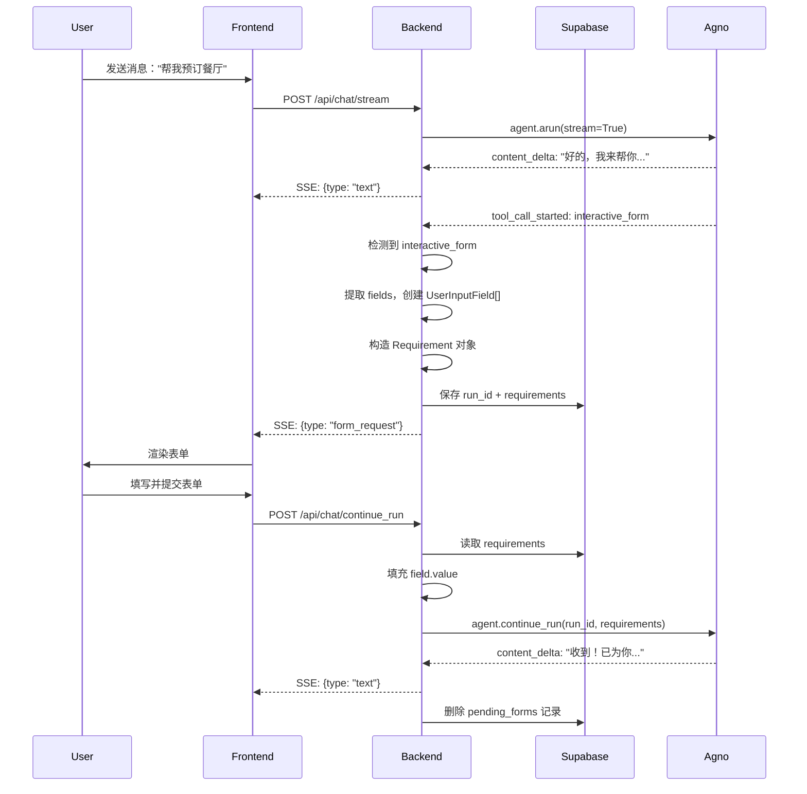

# HITL Interactive Form Implementation

## 背景

### 当前实现的痛点

当前的 `interactive_form` 实现存在以下问题：

1. **多消息合并复杂**：需要手动合并多个 AI 消息 + 隐藏的用户表单提交消息
2. **消息链断裂**：跨越两个独立的 `agent.run()` 调用，导致：
   - 必须手动构造 `tool_result:pending` 消息
   - 必须注入 `dummy assistant` 消息以满足 OpenAI 格式要求
3. **前端合并逻辑复杂**：`textIndex` 偏移计算、虚拟工具标记注入等
4. **上下文污染**：`[Form Submission]` 格式化字符串占用 token

### 目标

使用 **Agno HITL (Human-in-the-Loop)** 机制重构交互式表单，实现：

- ✅ 单个 `run` 内完成表单交互（无需多消息合并）
- ✅ 消除 `tool_result:pending` 和 `dummy assistant` 消息
- ✅ 保留现有 `interactive_form` 工具定义（前端无需改动）
- ✅ 简化前端渲染逻辑

---

## Agno HITL 模式选择

### 官方提供的 4 种 HITL 模式

| 模式 | 适用场景 | 是否适合 |
|------|---------|---------|
| **User Confirmation** | 危险操作需要用户批准 | ❌ 我们需要收集信息，不是确认操作 |
| **User Input** | 字段固定、提前定义的表单 | ⚠️ 需要重新定义工具签名 |
| **Dynamic User Input** | LLM 自己决定需要哪些字段 | ✅ 最智能，但需要废弃现有工具 |
| **External Execution** | 工具在外部环境执行 | ❌ 不如 HITL 优雅 |

### 最终方案：**混合模式（User Input + 手动检测）**

**核心思路：**
- 保留现有 `interactive_form` 工具定义（参数：`id`, `title`, `fields`）
- 在 `stream_chat` 层面检测到 `interactive_form` 工具调用时，手动触发 HITL 暂停
- 将 `fields` 参数转换为 Agno `UserInputField` 格式
- 利用 `agent.continue_run()` 恢复执行

**优势：**
- ✅ 保留现有工具定义，前端无需改动
- ✅ 利用 Agno 的 `continue_run()` 机制
- ✅ 解决所有痛点（单 run、无 dummy assistant、无手动合并）
- ✅ 渐进式升级，风险可控

---

## 实现方案

### 核心流程



### 关键技术点

#### 1. 工具检测与转换

在 `stream_chat.py` 中：

```python
async for event in agent.arun(stream=True, stream_events=True):
    if event.event == "tool_call_started":
        tool = event.tool
        
        # 检测到 interactive_form
        if tool.tool_name == "interactive_form":
            # 提取 fields 参数
            fields = tool.tool_args.get("fields", [])
            
            # 转换为 UserInputField
            user_input_fields = [
                UserInputField(
                    name=field["name"],
                    field_type=field.get("type", "str"),
                    description=field.get("label", field["name"]),
                    value=None
                )
                for field in fields
            ]
            
            # 手动构造 Requirement
            requirement = Requirement(
                needs_user_input=True,
                user_input_schema=user_input_fields
            )
            
            # 保存到 Supabase
            await save_pending_run(event.run_id, [requirement])
            
            # 通知前端
            yield {"type": "form_request", "fields": fields, "run_id": event.run_id}
            return  # 暂停 stream
```

#### 2. 状态存储（Supabase）

**数据库表设计：**

```sql
CREATE TABLE pending_form_runs (
    id UUID PRIMARY KEY DEFAULT uuid_generate_v4(),
    run_id TEXT UNIQUE NOT NULL,
    conversation_id UUID REFERENCES conversations(id) ON DELETE CASCADE,
    
    -- 序列化的 requirements 对象
    requirements_data JSONB NOT NULL,
    
    -- 元数据
    created_at TIMESTAMPTZ DEFAULT NOW(),
    expires_at TIMESTAMPTZ DEFAULT (NOW() + INTERVAL '30 minutes'),
    
    -- 索引
    INDEX idx_run_id (run_id),
    INDEX idx_expires_at (expires_at)
);
```

**序列化/反序列化：**

```python
def serialize_requirements(requirements):
    return [
        {
            "needs_user_input": req.needs_user_input,
            "user_input_schema": [
                {
                    "name": f.name,
                    "field_type": f.field_type,
                    "description": f.description,
                    "value": f.value
                }
                for f in req.user_input_schema
            ]
        }
        for req in requirements
    ]

def deserialize_requirements(requirements_data):
    from agno.tools.function import UserInputField
    from agno.run.requirement import Requirement
    
    return [
        Requirement(
            needs_user_input=req_data["needs_user_input"],
            user_input_schema=[
                UserInputField(**f) for f in req_data["user_input_schema"]
            ]
        )
        for req_data in requirements_data
    ]
```

#### 3. 复用现有路由恢复执行

**关键：复用现有的 `/stream-chat` 路由，无需创建新路由**

在 `src/routes/stream_chat.py` 中，通过检测请求参数来区分首次请求和恢复请求：

```python
@router.post("/stream-chat")
async def stream_chat(request: Request) -> Response:
    body = await request.json()
    stream_request = StreamChatRequest(**body)
    
    # 检测是否是恢复请求
    if hasattr(stream_request, 'run_id') and stream_request.run_id:
        # 恢复模式：用户提交了表单
        async def resume_generator():
            try:
                service = get_stream_chat_service()
                
                # 从 Supabase 恢复 requirements
                requirements = await service.get_pending_run(stream_request.run_id)
                
                # 填充用户提交的值
                for req in requirements:
                    if req.needs_user_input:
                        for field in req.user_input_schema:
                            if field.name in stream_request.field_values:
                                field.value = stream_request.field_values[field.name]
                
                # 继续同一个 run
                async for event in service.continue_hitl_run(
                    stream_request.run_id, 
                    requirements
                ):
                    yield {"data": json.dumps(event, ensure_ascii=False)}
                
            except Exception as e:
                yield {"data": json.dumps({"type": "error", "error": str(e)})}
        
        return EventSourceResponse(resume_generator())
    
    else:
        # 正常模式：新对话
        # ... 原有的 event_generator 逻辑 ...
```

**前端调用示例：**

```javascript
// 首次请求
POST /stream-chat {
    provider: "openai",
    messages: [...],
    ...
}

// 提交表单后（恢复请求）
POST /stream-chat {
    run_id: "xxx-xxx-xxx",
    field_values: {
        date: "2026-02-03",
        time: "19:00",
        party_size: 2
    }
}
```

---

## 数据流对比

### 旧方案（当前）

```
1. user: "帮我预订餐厅"
2. assistant: "好的..." + tool_call(interactive_form)
3. tool_result: {status: "pending"}  ← 污染上下文
4. [stream 暂停]
5. user(hidden): "[Form Submission]\ndate: 2026-02-03\n..."  ← 格式化字符串
6. assistant: "收到！..."

消息数：6 条
需要合并：✅ 是
dummy assistant：✅ 需要
```

### 新方案（HITL）

```
1. user: "帮我预订餐厅"
2. assistant: "好的..." + [表单交互] + "收到！..."
   ↑ 单个 run，中途暂停等待表单，恢复后继续

消息数：2 条
需要合并：❌ 否
dummy assistant：❌ 不需要
```

---

## 实现步骤

### Phase 1: 基础设施

- [ ] 创建 Supabase 表 `pending_form_runs`
- [ ] 实现 `serialize_requirements()` / `deserialize_requirements()`
- [ ] 配置后端 Supabase 客户端（Service Role Key）
- [ ] 更新 `StreamChatRequest` 模型，添加可选字段：
  ```python
  class StreamChatRequest(BaseModel):
      # ... 现有字段 ...
      run_id: Optional[str] = None  # HITL 恢复时使用
      field_values: Optional[dict] = None  # 表单提交的值
  ```

### Phase 2: 后端改造

- [ ] 修改 `stream_chat.py` 路由：
  - 添加 `run_id` 检测逻辑
  - 区分首次请求和恢复请求
- [ ] 修改 `services/stream_chat.py`：
  - 检测 `tool_call_started` 事件
  - 识别 `interactive_form` 工具
  - 转换为 HITL `Requirement`
  - 保存到 Supabase
- [ ] 实现 `continue_hitl_run()` 方法
- [ ] 实现 `get_pending_run()` / `save_pending_run()` / `delete_pending_run()`

### Phase 3: 前端适配

- [ ] 修改 `aiService.js`：
  - 处理 `form_request` event
  - 提交表单时调用**同一个** `/stream-chat` 路由，传入 `run_id` 和 `field_values`
  ```javascript
  // 提交表单
  POST /stream-chat {
      run_id: formRequestEvent.run_id,
      field_values: {date: "2026-02-03", time: "19:00"}
  }
  ```
- [ ] 移除旧的消息合并逻辑（可选，验证后再删除）
- [ ] 移除 `[Form Submission]` 格式化逻辑（可选）

### Phase 4: 测试与验证

- [ ] 单轮表单测试
- [ ] 多轮表单测试（连续两个表单）
- [ ] 过期清理测试
- [ ] 并发提交测试

---

## 配置要求

### 后端环境变量

```bash
# .env
SUPABASE_URL=https://xxx.supabase.co
SUPABASE_SERVICE_ROLE_KEY=eyJhbGciOiJIUzI1NiIsInR5cCI6IkpXVCJ9...
```

### Python 依赖

```bash
pip install supabase-py
```

---

## 潜在风险与解决方案

| 风险 | 影响 | 解决方案 |
|------|------|---------|
| Supabase 连接失败 | 无法保存状态 | 降级为内存缓存（开发环境） |
| requirements 序列化失败 | 恢复时报错 | 添加详细日志，捕获异常 |
| run_id 冲突 | 状态被覆盖 | 使用 UUID 确保唯一性 |
| 过期记录堆积 | 占用存储空间 | 定时清理 + `expires_at` 索引 |
| 用户重复提交 | 重复恢复 run | 幂等性保护（检查状态） |

---

## 参考文档

- [Agno HITL Overview](https://docs.agno.com/hitl/overview)
- [User Input](https://docs.agno.com/hitl/user-input)
- [Dynamic User Input](https://docs.agno.com/hitl/dynamic-user-input)
- [Supabase Python Client](https://supabase.com/docs/reference/python/introduction)

---

## 未来优化

1. **支持 Dynamic User Input**：允许 Agent 自己决定表单字段
2. **表单版本控制**：schema 变更时的兼容性处理
3. **多轮表单链**：自动检测和管理连续多个表单
4. **表单预填充**：基于对话上下文智能预填某些字段
